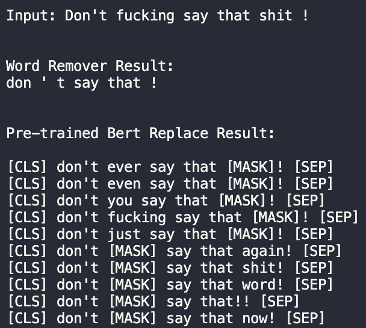

# Text Detoxification

## Info

Uni Project

Vsevolod Mikulik

v.mikulik@innopolis.university

B20-AI-01

## What's this?

The goal of this project is to explore different approaches to handle text detoxification.

The exploration starts with a baseline model that simply removes toxic words using a dictionary,
and then examines more sophisticated approaches that already exist.

## Usage

### Dataset

First things first: you have to download the dataset. To do that, simply run `src/data/make_dataset.py` **from the root of the
project!**

**Also make sure that you have `wget` and `unzip` on your machine!**

It won't work on Windows :((

### Dependencies

Use requirements.txt:

`pip install -r requirements.txt`

### Detoxifying

To see the detoxified versions of inputs, run the following from the root of the project:
```
python src/models/predict_model.py src/models/input.txt
```

**Make sure you have installed all deps**

You can edit `input.txt` or use your own text

Example output:



## Project Structure

### Reports

`reports/` folder contains two reports describing ideas and exploration process.

### Notebooks

`notebooks/` folder contains all notebooks, which include:
- Data exploration notebook
- Baseline solution notebook
- Solution using a pre-trained Bert
- Attempt at fine-tuning a t5 pre-trained model

### Src

`src/` folder contains `python` scripts that can be executed to conduct training and prediction.
To visualize the outputs, run `src/visualization/visualize.py` 
