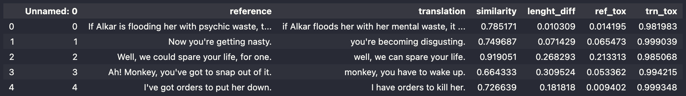

# Exploration Report

## References
- [Александр Панченко — Monolingual and Cross-lingual Text Detoxification](https://www.youtube.com/watch?v=PEo3UJKwsN0&t=1219s&ab_channel=%D0%9C%D0%A2%D0%A1Digital)
- [Monolingual and Cross-lingual Text Detoxification [in Russian]](https://www.youtube.com/watch?v=1RsHbmzY2Mg&ab_channel=BayesGroup.ru)
- [Text Detoxification using Large Pre-trained Neural Models](https://arxiv.org/abs/2109.08914)
- [GitHub repository related to the paper right above](https://github.com/s-nlp/detox)

## Data exploration

### Dataset

### Problem with translated sentences

It seems that so-called "translated" sentences in the dataset must always be less toxic than
"reference" sentences. However, we can notice that it's not true.
Therefore, we must check toxicity of each entry and rebuild the dataset again using
that information.

## Approaches

### Dictionary-based Toxic Word Removal/Replacement

This approach seems to be the easiest to implement, but it will also yield sentences that most probably will sound
artificially. It also does not contain any ML, however it can be perceived as a baseline solution.

Steps:
1. Iterate over inputs and identify toxic words using the dictionary.
2. Remove those words or replace them with neutral alternatives.

### Toxic Word Replacement with Bert

This approach is slightly more advanced. I thought of using dictionary again, but this time the words will be masked,
and then a pre-trained Bert will replace them using the context of the sentence.

Steps:
1. Iterate over inputs and identify toxic words using the dictionary.
2. Mask the words
3. Use a pre-trained Bert model to replace the words.

### Pre-trained T5

I also wanted to fine-tune T5 using the dataset given in this assignment. However,
I didn't quite manage to do that. There is an attempt in `notebooks/4.0-t5-pretrained-finetune.ipynb`
